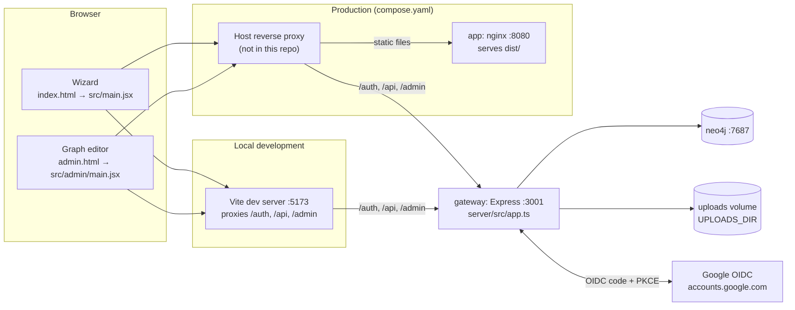
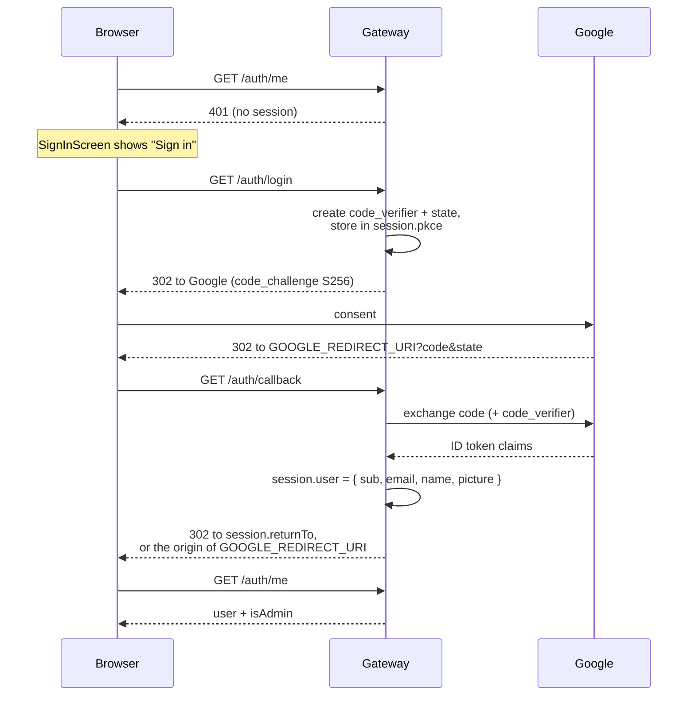

# Architecture

This page explains how the pieces of the planning tool fit together: the two browser apps, the
Express gateway, Neo4j and Google sign-in. Field-level details of the data live in
[data-model.md](data-model.md). Environment variables are covered in
[configuration.md](configuration.md).

## System overview



- **Two front-ends, one build.** `vite.config.js` declares two Rollup inputs, `index.html`
  (the wizard) and `admin.html` (the graph editor). Both share `src/contexts/AuthContext.jsx`,
  `src/theme.css` and parts of `src/components/`.
- **The browser only talks to its own origin.** Every API call is a same-origin `fetch` with
  `credentials: 'include'`. In development Vite proxies `/auth`, `/api` and exactly `/admin` to
  the gateway. In production a reverse proxy on the host (not part of this repo) must do the
  same: send those paths to the `gateway` container (published on `127.0.0.1:3001`) and send
  everything else to the `app` container (`8080`).
- **The gateway owns all secrets and all data access.** The browser never sees a Google
  token or talks to Neo4j directly.

## Gateway (`server/`)

`server/src/server.ts` starts the app built in `server/src/app.ts`. Config is loaded and
validated once in `server/src/config.ts` (see [configuration.md](configuration.md)).

### Middleware order

1. `app.set('trust proxy', 1)` makes `req.secure` honour `X-Forwarded-Proto`. Without it,
   secure cookies are silently dropped behind the reverse proxy.
2. `cors({ origin: WEB_ORIGIN, credentials: true })`.
3. `express.json()`.
4. `express-session` with an httpOnly, `sameSite: 'lax'` cookie (`connect.sid`). The cookie is
   `secure` when `NODE_ENV=production` and expires after 7 days. The store is the default
   in-memory store.
5. The routers, mounted in the order shown in the route table below.

### Connector pattern

Each feature lives in `server/src/connectors/<name>/`, typically as:

- `types.ts`: the data shapes and a `*Repository` interface
- `neo4j*Repository.ts`: the implementation (all Cypher lives here)
- `routes.ts`: an Express `Router` that validates input (often with zod), calls the
  repository, and maps errors to JSON `{ error }` responses

Connectors: `oidc` (sign-in), `graph` (wizard content), `progress` (per-user wizard state),
`resources` (PDF uploads), `admins` (admin list), plus `neo4j/driver.ts` (one lazily created,
shared driver). `xapi/` contains only a README describing a future integration owned by
another team.

The graph connector has a second implementation, `stubRepository.ts`. It serves
`docs/wizardGraph.json` from memory when `GRAPH_BACKEND=stub`. Writes to it are lost on
restart. The progress and admin connectors always use Neo4j, so the stub is only useful for
rough front-end work.

### Authorization

`server/src/middleware.ts` has two guards:

- `requireAuth`: there must be a signed-in user on the session, otherwise 401.
- `requireAdmin`: signed in, and `isAdminEmail(email)` is true, otherwise 401 or 403.

`isAdminEmail` (`connectors/admins/isAdminEmail.ts`) returns true when the lowercased email is
either in the `ADMIN_EMAILS` env var (a break-glass list, so a fresh or unreachable database
still has an admin) or matches an `(:Admin)` node in Neo4j. If the Neo4j lookup throws, only
`ADMIN_EMAILS` counts.

### Routes

| Method   | Path                          | Guard          | Purpose                                                          |
| -------- | ----------------------------- | -------------- | ---------------------------------------------------------------- |
| `GET`    | `/healthz`                    | none           | `{ status, connectors }` readiness info                          |
| `GET`    | `/auth/login`                 | none           | Starts Google sign-in (PKCE), redirects to Google                |
| `GET`    | `/auth/callback`              | none           | Google redirect target; creates the session                      |
| `POST`   | `/auth/logout`                | none           | Destroys the session and clears the cookie                       |
| `GET`    | `/auth/me`                    | session        | Current user `{ sub, email, name, picture, isAdmin }`, or 401    |
| `GET`    | `/api/graph`                  | `requireAuth`  | The whole wizard graph `{ startNodeId, nodes, edges }`           |
| `PUT`    | `/api/graph`                  | `requireAdmin` | Replaces the whole graph (used by the graph editor)              |
| `GET`    | `/api/graph/nodes/:id`        | `requireAuth`  | One node                                                         |
| `POST`   | `/api/graph/nodes`            | `requireAdmin` | Creates a node, body `{ node }`; 409 if the id exists            |
| `PATCH`  | `/api/graph/nodes/:id`        | `requireAdmin` | Merges fields into a node; `null` clears a field                 |
| `DELETE` | `/api/graph/nodes/:id`        | `requireAdmin` | Deletes a node and its relationships; refuses `welcome`          |
| `POST`   | `/api/graph/edges`            | `requireAdmin` | Creates an edge, body `{ sourceId, edge }`                       |
| `PATCH`  | `/api/graph/edges/:id`        | `requireAdmin` | Updates an edge, including re-targeting it                       |
| `DELETE` | `/api/graph/edges/:id`        | `requireAdmin` | Deletes an edge                                                  |
| `GET`    | `/api/progress`               | `requireAuth`  | The signed-in user's saved progress, or `null`                   |
| `PUT`    | `/api/progress`               | `requireAuth`  | Saves `{ currentNodeId, answers, history }`                      |
| `DELETE` | `/api/progress`               | `requireAuth`  | Clears saved progress ("Start over")                             |
| `POST`   | `/api/resources/upload`       | `requireAdmin` | Multipart `file` field, PDF only, up to 25 MB; returns `{ url }` |
| `GET`    | `/api/resources/files/<name>` | `requireAuth`  | Serves an uploaded PDF from `UPLOADS_DIR`                        |
| `GET`    | `/api/admins`                 | `requireAdmin` | `{ admins, bootstrap }` (Neo4j admins + `ADMIN_EMAILS`)          |
| `POST`   | `/api/admins`                 | `requireAdmin` | Adds an admin `{ email }`                                        |
| `DELETE` | `/api/admins/:email`          | `requireAdmin` | Removes an admin; refuses yourself and the last admin            |
| `GET`    | `/admin`                      | session        | Gate for the graph editor (see below)                            |

## Sign-in

The gateway acts as a backend-for-frontend (BFF). It runs the OAuth authorization-code flow
with PKCE against Google (`connectors/oidc/`) and gives the browser only a session cookie.



- `src/contexts/AuthContext.jsx` calls `/auth/me` once on load and exposes
  `{ user, loading, signOut }`. Both front-ends wrap their tree in `AuthProvider`.
- After login, the browser goes to `session.returnTo` if set (only `/admin` sets it), otherwise
  to the origin of `GOOGLE_REDIRECT_URI`. So that variable also decides where users land.
- The OIDC client is discovered from `https://accounts.google.com` on first use and cached.
- Sign-ins aren't recorded anywhere. A `(:User)` node is only created the first time a user's
  progress is saved.

### The `/admin` gate

`GET /admin` (`server/src/app.ts`) redirects signed-out users to `/auth/login`, with
`returnTo=/admin`. It returns 403 HTML for non-admins and redirects admins to `/admin.html`,
the static editor bundle. `admin.html` itself is a public static file. The real protection is
that every write route requires an admin, and that `AdminApp` shows a 403 screen when
`user.isAdmin` is false.

## Wizard runtime (`src/`)

### Component and provider tree

```
main.jsx
└─ AuthProvider                     contexts/AuthContext.jsx
   └─ App.jsx
      └─ DrawerProvider             contexts/DrawerContext.jsx    (sidebar open/closed)
         └─ AppWithEngine           creates useGraphEngine()
            └─ EditModeProvider     contexts/EditModeContext.jsx  (admin inline editing)
               └─ AppContent        progress load/save, resume screen
                  └─ WizardNavProvider  contexts/WizardNavContext.jsx (graph + overlays for deep children)
                     ├─ EditModeBar
                     ├─ SignInScreen | ResumeScreen | NodeRenderer
                     ├─ Breadcrumb
                     └─ ResourceLibraryOverlay, FaqOverlay, GlossaryOverlay
```

### Graph engine

`src/graph/useGraphEngine.js` is the wizard's state machine. It fetches `/api/graph` once and
holds:

| State           | Meaning                                                                    |
| --------------- | -------------------------------------------------------------------------- |
| `graph`         | `{ startNodeId, nodes, edges }` as returned by the API (or the edit draft) |
| `currentNodeId` | The screen being shown                                                     |
| `answers`       | `{ [storeKey]: value }` collected from edges the user took                 |
| `history`       | Stack of previously visited node ids, for Back                             |

Actions:

- `advance(edgeId, dynamicValue?)` follows an edge. If the edge has a `storeKey`, it records
  `edge.value`, or `dynamicValue` when the edge has no value (the checkbox submit case). It
  then pushes the current node onto `history`.
- `back()` pops `history`. The browser Back button triggers the same thing: every
  navigation calls `history.pushState`, and a `popstate` listener calls `back()`.
- `jumpAlongPath(edgeIds)` is used by the sidebar. It replays an explicit chain of edges,
  records each edge's fixed `value`, and jumps to the last edge's target.
- `goToNode(id)` is used by edit mode to jump straight to a screen.
- `restore(progress)` and `resetToStart()` load saved progress or wipe it.

`src/components/NodeRenderer.jsx` maps `node.type` to a component in `src/components/nodes/`
(`welcome`, `multiChoice`, `radioSurvey`, `checkboxSurvey`, `videoInfo`, `results`). It passes
in the node's edges in `edgeIds` order. Edge components in `src/components/edges/` render each
option and call `advance`. `ResultsNode` picks its content with
`src/graph/resolveResult.js` (see [Resolvers](data-model.md#resolvers)).

### Navigation helpers

These are pure functions in `src/graph/`. They are recomputed from the graph on every render
and never stored:

- `getNodePath` runs a breadth-first search from the start node to the current node, skipping
  disabled edges. It drives the breadcrumb and the sidebar's active row. It gives the
  structural path, not the user's click history.
- `getPreviousAnswerLabel` finds the label of the edge that led into the current screen,
  shown as a heading. It only applies when the previous node was a `multiChoice` or
  `radioSurvey`.
- `buildUseCaseTree` builds the "Your Goals" sidebar (`components/shared/UseCaseNav.jsx`) by
  walking forward from the start node. Single-button screens are passed through; every option
  on the first `multiChoice` screens becomes a row, nested up to two levels deep. Nothing is
  hard-coded, so new options show up automatically.

### Saved progress

`AppContent` in `src/App.jsx`:

1. After sign-in, `GET /api/progress`. If the user already had progress in this browser tab
   (a page refresh, detected by the `session-user` key in `sessionStorage`), it is restored
   silently. A fresh sign-in shows `ResumeScreen` first.
2. On every change to `currentNodeId`, `answers` or `history` it sends
   `PUT /api/progress`. This is skipped while the resume screen is up, while the user is still
   on the untouched start screen, and in edit mode, so admins don't overwrite their own place.
3. "Start over" sends `DELETE /api/progress` and resets the engine.

### Content that is not in the graph

The Resource Library, FAQ and Glossary overlays read hard-coded data from
`src/data/staticResources.js`, `src/data/faqData.js` and `src/data/glossaryData.js`. Changing
them requires a code change and a deploy.

## Editing content

Admins have two ways to change the graph. Both end up in the same Neo4j data but write it
differently.

### 1. Inline edit mode (inside the wizard)

Admins see an "Edit Mode" entry in the user menu (`components/auth/UserMenu.jsx`). Edit mode
(`contexts/EditModeContext.jsx`) edits the wizard's own graph state, so each screen
renders the draft exactly as a visitor would see it. Text becomes editable in place
(`components/edit/EditableText.jsx`), and buttons can be added, removed, reordered and
re-targeted.

- Draft changes go through the pure functions in `src/graph/editMutations.js`.
- **Save** runs `diffGraph(baseline, draft)` (`src/graph/diffGraph.js`). It produces an
  ordered list of granular operations: create nodes, create edges, update nodes (including
  edge order), update edges, delete edges, delete nodes.
- `applyGraphOps` (`src/graph/applyGraphOps.js`) sends them one by one to the
  `POST`/`PATCH`/`DELETE /api/graph/...` routes. It stops at the first failure and reports how
  many changes were applied. The rest of the draft stays on screen so the admin can retry.
- Because only changed screens and buttons are sent, two admins editing different screens
  don't overwrite each other.

### 2. Graph editor (`/admin`)

`src/admin/AdminApp.jsx` is a React Flow canvas for the whole graph:

- Drag nodes around, connect and reconnect edges, add nodes, auto-arrange (dagre,
  `src/admin/state/layout.js`), and undo/redo.
- The inspector panel (`src/admin/components/Inspector/`) edits node and edge fields,
  including the results-screen resolver editor (`src/components/editor/ResolversEditor/`).
- The Admins modal manages `(:Admin)` nodes.

`src/admin/state/graphFlowAdapter.js` converts between the API shape and React Flow's
node and edge arrays. Each flow edge carries its index in the source node's `edgeIds` as
`data.order`. **Save** converts back and sends the whole graph to `PUT /api/graph`, which
deletes every `WizardNode` and `OPTION` and rewrites them. Node positions
(`positionX`/`positionY`) are saved this way too.

### PDF uploads

In the resolver editor (`ResolversEditor/ResourceRow.jsx`) an admin can upload a PDF instead
of pasting a URL. The gateway stores it in `UPLOADS_DIR` under a random UUID name and returns
`/api/resources/files/<uuid>.pdf`, which is saved as the resource's `url`. Files are only
served to signed-in users. Nothing ever deletes uploaded files, even when no resource
references them any more.

## Peripheral and legacy pieces

- **`docs/index.html`** is the original standalone, Mermaid-based graph editor. It is still
  published by GitHub Pages from `main:/docs`, but it isn't connected to Neo4j.
- **`.github/workflows/update-wizard-graph.yml`** is a manual workflow the legacy editor
  used to commit a new `docs/wizardGraph.json`. Nothing reads that file at runtime, so the
  workflow no longer affects the live app.
- **`.github/workflows/add-to-project.yml`** adds new issues to the INFERable org project
  board.
- **`server/src/connectors/xapi/`** is a placeholder for a future learning-analytics (xAPI)
  integration. No code exists yet.

## Known quirks and gotchas

- **The two save paths can clobber each other.** `PUT /api/graph` (graph editor) rewrites
  the entire graph from the editor's copy, so any inline edit-mode save made after the editor
  loaded is lost. Reload the editor before saving if someone may have edited inline.
- **Sessions are in memory.** Restarting the gateway signs everyone out. Running more than
  one gateway instance would break sign-in. A persistent store (e.g. Redis) is needed before
  scaling out.
- **Duplicate dev servers break sign-in.** If two `tsx watch` gateway processes are running,
  requests can land on different in-memory session stores, which shows up as
  `Missing PKCE session` on `/auth/callback`. Kill the stale process.
- **The start node is hard-coded.** `startNodeId` is always `welcome`
  (`neo4jRepository.getWizardGraph`), and deleting that node is refused.
- **Unused Google client-side config.** `VITE_GOOGLE_CLIENT_ID` (Dockerfile build arg,
  `compose.yaml`) and the `@react-oauth/google` dependency are left over from the old
  client-side sign-in. Nothing in `src/` uses them.
- **Some node fields have no effect.** `layout` and `challengeBar` are stored and editable,
  but no component reads them, and `checkboxSurvey` ignores `submitLabel`. See
  [data-model.md](data-model.md#quirks).
- **The Vite dev server has a hard-coded `allowedHosts` list** (`vite.config.js`). Add your
  hostname there if you serve the dev server through a tunnel or a LAN name.
