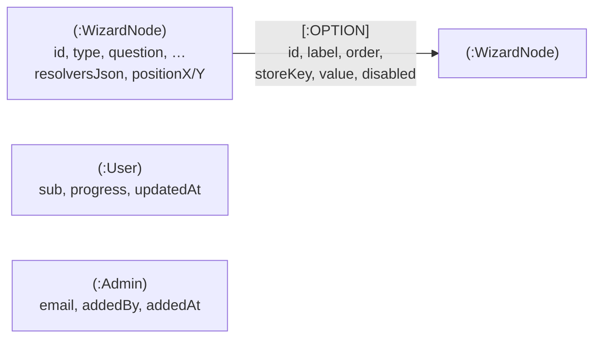

# Data model

All persistent data lives in one Neo4j database: the wizard's content graph, each user's saved
progress, and the admin list. Uploaded PDFs are the only data outside Neo4j; they are stored
as files in `UPLOADS_DIR` (see [architecture.md](architecture.md#pdf-uploads)).

The wizard graph exists in three shapes, and most bugs in this area come from converting
between them:

1. **Neo4j storage**: `:WizardNode` nodes joined by `:OPTION` relationships.
2. **API JSON** (`WizardGraph` in `server/src/connectors/graph/types.ts`): what
   `GET /api/graph` returns and the client works with.
3. **Graph editor state**: React Flow node and edge arrays, used only inside `/admin`
   (`src/admin/state/graphFlowAdapter.js`).

> The live database is the source of truth. `docs/wizardGraph.json` is seed data only and is
> usually out of date.

## Neo4j schema



`:User` and `:Admin` are standalone nodes with no relationships.

| Label / type  | Properties                                                                                                                | Written by                                       |
| ------------- | ------------------------------------------------------------------------------------------------------------------------- | ------------------------------------------------ |
| `:WizardNode` | `id` plus every node field below. `resolvers` is stored as a JSON string in `resolversJson`. `edgeIds` is **not** stored. | `connectors/graph/neo4jRepository.ts`, seed      |
| `:OPTION`     | `id`, `label`, `order` (0-based position among the source node's options), and optionally `storeKey`, `value`, `disabled` | `connectors/graph/neo4jRepository.ts`, seed      |
| `:User`       | `sub` (Google subject id), `progress` (JSON string), `updatedAt` (datetime)                                               | `connectors/progress/neo4jProgressRepository.ts` |
| `:Admin`      | `email` (trimmed and lowercased), `addedBy` (email), `addedAt` (datetime)                                                 | `connectors/admins/neo4jAdminRepository.ts`      |

Constraints, created by the seed script with `IF NOT EXISTS`:

- `:WizardNode(id)` is unique
- `:Admin(email)` is unique

`:User.sub` has no constraint. Progress writes use `MERGE` on it.

### How storage maps to the API

The functions involved are `nodeToProps` and `edgeToRelProps` in
`server/src/connectors/graph/graphUtils.ts`, and `buildNode`/`buildEdge` in
`neo4jRepository.ts`.

- **Edges belong to nodes implicitly.** In the API, an edge has no `sourceId`. It belongs to
  whichever node lists it in `edgeIds`. In Neo4j that ownership is the relationship's start
  node.
- **`edgeIds` order comes from `OPTION.order`.** On read, `edgeIds` is built by collecting
  outgoing `OPTION` ids sorted by `order`. To reorder options, `PATCH` the node with a new
  `edgeIds` array, and the repository rewrites each relationship's `order`.
- **`resolvers` round-trips through JSON.** It is written as `resolversJson` and parsed back
  on read. Other node fields are stored as plain properties, so node fields must be
  primitives or arrays of primitives.
- **`null` clears a field.** `PATCH` bodies go into Cypher `SET n += $props`, and setting a
  property to `null` removes it. `diffGraph` relies on this to delete fields.
- **Re-targeting an edge recreates it.** Neo4j can't move a relationship's end node, so
  `updateEdge` deletes the relationship and creates a new one with the same properties and
  `order`.
- **`startNodeId` is always `"welcome"`.** It isn't stored anywhere; `getWizardGraph`
  hard-codes it.

## Wizard graph (API JSON)

```json
{
	"startNodeId": "welcome",
	"nodes": { "<nodeId>": { "id": "<nodeId>", "type": "multiChoice", "edgeIds": ["<edgeId>"] } },
	"edges": { "<edgeId>": { "id": "<edgeId>", "label": "Employer", "targetNodeId": "<nodeId>" } }
}
```

A **node** is one screen. An **edge** is one option or button on that screen, pointing to the
screen it leads to.

### Node fields (all types)

| Field          | Type     | Notes                                                                                                                                  |
| -------------- | -------- | -------------------------------------------------------------------------------------------------------------------------------------- |
| `id`           | string   | Unique. New nodes get `node-<n>`. Renaming is possible in the graph editor.                                                            |
| `type`         | string   | `welcome`, `multiChoice`, `radioSurvey`, `checkboxSurvey`, `videoInfo` or `results`. Chooses the component in `src/components/nodes/`. |
| `edgeIds`      | string[] | This screen's options in display order. Derived, not stored.                                                                           |
| `label`        | string   | Optional display name on the graph editor canvas. Falls back to `id`.                                                                  |
| `layout`       | string   | `hero` or `compact`. Stored and editable but not rendered (see [Quirks](#quirks)).                                                     |
| `challengeBar` | boolean  | Stored and editable but not rendered (see [Quirks](#quirks)).                                                                          |
| `positionX/Y`  | number   | Canvas position in the graph editor. Missing positions are auto-laid-out on load.                                                      |

### Node types

The fields each type reads are taken from its component in `src/components/nodes/`. New-node
defaults come from `NODE_TYPE_DEFAULTS` in `src/admin/components/nodes/nodeTypeMeta.js`.

| Type             | Fields it renders                                              | Behaviour                                                                                                                                                                           |
| ---------------- | -------------------------------------------------------------- | ----------------------------------------------------------------------------------------------------------------------------------------------------------------------------------- |
| `welcome`        | `heading`, `body`                                              | Hero screen. Only the **first** edge is rendered, as the call-to-action button.                                                                                                     |
| `multiChoice`    | `question`                                                     | One button per edge. Tapping one advances immediately. These screens also form the sidebar's "Your Goals" tree.                                                                     |
| `radioSurvey`    | `intro` (optional), `question`, `submitLabel` (default `Next`) | One radio per edge. The submit button follows the selected edge.                                                                                                                    |
| `checkboxSurvey` | `question`, `submitEdgeId`                                     | One checkbox per edge. The submit button follows `submitEdgeId`, and its label is that edge's `label`. The submit edge's `storeKey` receives an **array of the selected edge ids**. |
| `videoInfo`      | `intro`, `videoUrl`, `videoAlt`, `linkLabel`, `linkDisplay`    | Video card, plus an optional link to `videoUrl` shown as `linkDisplay`. Only the **first** edge is rendered, as the continue button.                                                |
| `results`        | `resolvers`                                                    | End screen. Content is chosen from `resolvers` based on the user's answers. Outgoing edges are not rendered.                                                                        |

The live content currently uses only `welcome`, `multiChoice`, `radioSurvey` and `results`.

### Edge fields

| Field          | Type    | Notes                                                                                                                 |
| -------------- | ------- | --------------------------------------------------------------------------------------------------------------------- |
| `id`           | string  | Unique across the graph. New edges get `e_<sourceId>_<targetId>` (with `_<n>` added if that id is taken).             |
| `label`        | string  | The button or option text.                                                                                            |
| `targetNodeId` | string  | The screen this edge leads to.                                                                                        |
| `storeKey`     | string  | Optional. When the edge is taken, `answers[storeKey]` is set.                                                         |
| `value`        | string  | The value stored at `storeKey`. If it's missing, the value passed to `advance()` is used instead (the checkbox case). |
| `disabled`     | boolean | Optional. The option renders but can't be clicked; breadcrumb, path and sidebar logic skip it.                        |

### Answers

`answers` is a flat object built up as the user moves through the wizard, e.g.
`{ "category": "employer", "role": "…", "challenge": "…" }`. Taking a second edge with the same
`storeKey` overwrites the earlier value. The live graph uses the keys `category`, `role`,
`challenge` and `skills-framework`. Answers matter for two things: they are saved with
progress, and they select a results screen's content.

## Resolvers

A `results` node has an ordered `resolvers` array. `src/graph/resolveResult.js` renders the
**first** resolver whose `when` matches the current answers. If none match, it uses the
**last** one.

```json
{
	"when": { "challenge": ["ced-01", "ced-02"], "role": ["employer"] },
	"recommendation": "Lead sentence, shown highlighted.",
	"bodyText": "Supporting text.",
	"resources": [],
	"footer": "Closing line."
}
```

`when` matches only if **every** key matches (AND across keys), and a key matches if the
user's answer is **one of** the listed values (OR within a key). An empty `when: {}` always
matches, which makes it a good catch-all as the last resolver.

| Field                  | Notes                                                                      |
| ---------------------- | -------------------------------------------------------------------------- |
| `when`                 | See above. Required.                                                       |
| `recommendation`       | Lead sentence.                                                             |
| `bodyText`             | Body copy.                                                                 |
| `resources`            | Resource cards, rendered in array order (see below).                       |
| `footer`               | Small closing line.                                                        |
| `videoUrl`, `videoAlt` | Optional video card. Rendered, but no editor form exposes these.           |
| `cta`                  | Optional `{ label, url }` button. Rendered, but no editor form exposes it. |

### Resources

Defined by `src/components/shared/ResourceItem.jsx`, which renders them, and
`src/components/editor/ResolversEditor/resolverSanitize.js`, which cleans them on save.

| `type`      | Fields                                                                 | Required to be saved                         |
| ----------- | ---------------------------------------------------------------------- | -------------------------------------------- |
| `pdf`       | `label`, `url`, `pageStart`, `pageEnd`, `wholeDocument`, `description` | `label`, plus `pageStart` or `wholeDocument` |
| `link`      | `label`, `url`, `description`                                          | `label` and `url`                            |
| `reference` | `label`, `description`                                                 | `label`                                      |
| `prompt`    | `label`, `text`                                                        | `label` or `text`                            |

- **PDF page links.** `pageStart` is the source of truth. On save, any `#page=` anchor on
  `url` is replaced with `#page=<pageStart>`. If `pageStart` is empty, it is backfilled from an
  existing anchor. The badge shows `p. N` or `p. N–M`, or "Whole document".
- **Incomplete resources are silently dropped on save.** The editor shows a warning while
  editing (`missingResourceFieldLabel`), but anything still incomplete at save time is removed.
- **Prompts** render as a copyable text block (`PromptBlock.jsx`) with a fixed warning not to
  paste sensitive data.
- **`_key`.** Both editors add a client-only `_key` to each resolver and resource so lists
  have stable React keys. `sanitizeResolvers` copies only known fields, so `_key` never
  reaches the server. The migration scripts did write some `_key`s into Neo4j; they're
  harmless.

## User progress

Stored on `(:User {sub})` as a JSON string in `progress`. Shape
(`server/src/connectors/progress/types.ts`):

```json
{
	"currentNodeId": "role",
	"answers": { "category": "employer" },
	"history": ["welcome", "category"]
}
```

`PUT /api/progress` replaces it whole. `DELETE` removes `progress` and `updatedAt` but leaves
the `:User` node. Nothing validates that `currentNodeId` still exists, so progress pointing at
a deleted screen will break that user's wizard until they start over.

## Admins

`(:Admin {email})` nodes are managed from the graph editor's Admins modal
(`/api/admins`). Emails in the `ADMIN_EMAILS` env var count as admins too, but they are not
stored. The API refuses to remove the caller's own email or the last stored admin.

## Seeding and migrations

`pnpm --filter @usccf/api-gateway seed:graph` (`server/src/seed/graphSeed.ts`):

1. Creates the two uniqueness constraints.
2. For every node in `docs/wizardGraph.json`, does `MERGE` by `id` and **replaces** all its
   properties.
3. **Deletes every `OPTION` relationship in the database**, then recreates the edges from
   the JSON.

> **Do not run the seed against a database with real content.** Nodes that exist only in
> Neo4j keep their properties but lose all their outgoing edges, and any node also in the
> JSON is reset to the JSON version. It is meant for empty databases.

`server/src/scripts/` holds two one-off migrations that rewrote `resolversJson` in place. Both
have been applied and are kept for reference:

- `migratePromptBlockToResources.ts` turned the old per-resolver `promptBlock` object into a
  `prompt` resource at the front of `resources`.
- `migratePdfPageRanges.ts` turned the old free-text PDF `pages` field into
  `pageStart`/`pageEnd`. `"all"` became `wholeDocument`, and comma-separated lists were split
  into one resource per range.

## Inspecting the data

Read-only Cypher you can run in the Neo4j browser (`localhost:7474`) or `cypher-shell`:

```cypher
// Screens by type
MATCH (n:WizardNode) RETURN n.type, count(*) ORDER BY count(*) DESC;

// One screen and its options, in display order
MATCH (n:WizardNode {id: 'welcome'})-[r:OPTION]->(t)
RETURN r.order, r.id, r.label, t.id ORDER BY r.order;

// Screens nothing links to (other than the start screen)
MATCH (n:WizardNode) WHERE NOT ()-[:OPTION]->(n) AND n.id <> 'welcome' RETURN n.id;

// Every value recorded for a given answer key, and where each edge leads
MATCH ()-[r:OPTION {storeKey: 'challenge'}]->(t:WizardNode) RETURN r.value, t.id;

// Admins
MATCH (a:Admin) RETURN a.email, a.addedBy, a.addedAt;
```

## Quirks

- **`layout` and `challengeBar` don't do anything.** Every node has them and both editors
  expose them, but no component reads them. Each node type always uses its own fixed
  layout. The same goes for `submitLabel` on `multiChoice` and `checkboxSurvey` nodes.
- **`checkboxSurvey` is half-built.** Its submit edge has to be one of the node's own
  outgoing edges (Neo4j can only store edges that have a source), so it also renders as a
  checkbox option. The stored answer is an array of edge ids, and `resolveResult` can't match
  arrays. No live content uses this type.
- **Orphan edges.** An edge in `edges` that no node lists in `edgeIds` can exist in JSON, but
  not in Neo4j. The graph editor carries such edges through a save, and `replaceGraph` then
  quietly drops them.
- **The start node is fixed.** It must have id `welcome`.
