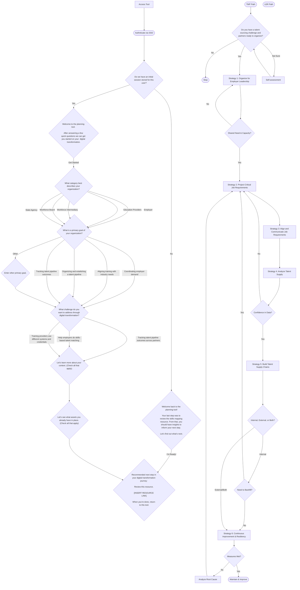

```mermaid
%%{init: {'theme': 'base'}%%
graph TD
AccessTool[Access Tool] --> Login

Login([Authnticate via SSO]) --> IsNew{Is this a new user?}

IsNew{Do we have an initial session stored for this user?}
IsNew -- Yes --> Welcome{Welcome to the Planning Tool}
IsNew -- No --> WelcomeBack{Welcome back to the Planning Tool}

Welcome{Welcome to the planning tool. 

After answering a few quick questions we can get you started on your  digital transformation.}
Welcome -- Get Started --> GetStarted

WelcomeBack{Welcome back to the planning tool!

Your last step was to review the skills mapping resource. From that, you should have insights to inform your next step. 

Let’s find out what’s next.}
WelcomeBack -- "I'm Ready!" --> Start

GetStarted{What category best describes your organization?}
GetStarted -- Employer --> PrimaryGoal["Store state Organization = Employer"]
GetStarted -- Education Providers --> PrimaryGoal[Store state Organization = Education Providers]
GetStarted -- Workforce Intermediary --> PrimaryGoal[Store state Organization = Workforce Intermediary]
GetStarted -- Workforce Board --> PrimaryGoal[Store state Organization = Workforce Board]
GetStarted -- State Agency--> PrimaryGoal[Store state Organization = State Agency]

PrimaryGoal{What is a primary goal of your organization?}
PrimaryGoal -- Coordinating employer demand --> NextChallenge[Store state PrimaryGoal = Coordinating employer demand]
PrimaryGoal -- Aligning training with industry needs --> NextChallenge[Store state PrimaryGoal = Aligning training with industry needs]
PrimaryGoal -- Organizing and estalishing a talent pipeline --> NextChallenge[Store state PrimaryGoal = Organizing and estalishing a talent pipeline]
PrimaryGoal -- Tracking talent pipeline outcomes --> NextChallenge[Store state PrimaryGoal = Tracking talent pipeline outcomes]
PrimaryGoal -- Other --> PrimaryGoalOther[Store state PrimaryGoal = Other]

PrimaryGoalOther{Enter other primary goal.} --> NextChallenge

NextChallenge{What challenge do you want to address through digital transformation?}
NextChallenge -- Tracking talent pipeline outcomes across partners --> Context[Store state NextChellenge = Tracking talent pipeline outcomes across partners]
NextChallenge -- Help employers do skills-based talent matching --> Context[Store state NextChellenge = Help employers do skills-based talent matching]
NextChallenge -- Training providers use different systems and credentials --> Context[Store state NextChellenge = Training providers use different systems and credentials]

Context{"Let’s learn more about your context. (Check all that apply)"} --> Assets

Assets{"Let’s see what assets you already have in place. (Check all that apply)"} --> Start

Start([FirstStep])
Start{"Recommended next step in your digital transformation journey: 

Review this resource. 

[INSERT RESOURCE LINK]

When you’re done, return to this tool."}

TPM([TMP Path]) --> Fit([Is TPM a Good Fit?])
    
    Fit{Do you have a talent sourcing challenge and partners ready to organize?}
    Fit -- No --> End([Stop])
    Fit -- Yes --> Strategy1[Strategy 1: Organize for Employer Leadership]
    Fit -- Not Sure --> Self-assessment

Self-assessment --> Fit
    
    Strategy1 --> SharedNeed{Shared Need & Capacity?}
    
    SharedNeed -- No --> Strategy1
    SharedNeed -- Yes --> Strategy2[Strategy 2: Project Critical Job Requirements]
    
    Strategy2 --> Strategy3[Strategy 3: Align and Communicate Job Requirements]
    Strategy3 --> Strategy4[Strategy 4: Analyze Talent Supply]
    
    Strategy4 --> DataConfidence{Confidence in Data?}
    
    DataConfidence -- No --> Strategy2
    DataConfidence -- Yes --> Strategy5[Strategy 5: Build Talent Supply Chains]
    
    Strategy5 --> PipelineType{Internal, External, or Both?}
    
    PipelineType -- Internal --> Backfill{Need to Backfill?}
    Backfill -- Yes --> Strategy2
    Backfill -- No --> Strategy6
    
    PipelineType -- External/Both --> Strategy6[Strategy 6: Continuous Improvement & Resiliency]
    
    Strategy6 --> Performance{Measures Met?}
    
    Performance -- No --> RootCause[Analyze Root Cause]
    RootCause --> Strategy2
    Performance -- Yes --> Done([Maintain & Improve])

LER([LER Path])

```
IL NEED: Tools to match CTE learners to workforce learning opportunities. Tools ad strategies, e.g. enabling coaches and connections.  
