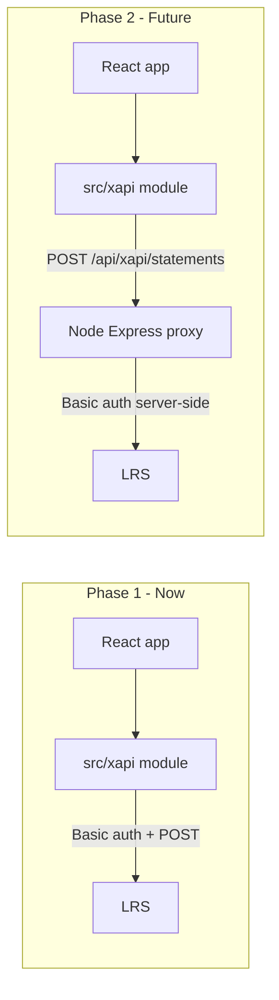

# xAPI LRS Foundation Plan

## Context

- **Current app:** React 19 + Vite static SPA, deployed via nginx ([`Dockerfile`](c:\Users\natec\Documents\GitHub\USCCF-digital-planning-tool\Dockerfile)). No backend today.
- **Auth:** Google OAuth client-side; actor identity available as `{ sub, email, name }` in [`AuthContext.jsx`](c:\Users\natec\Documents\GitHub\USCCF-digital-planning-tool\src\contexts\AuthContext.jsx).
- **Graph engine:** Central navigation in [`useGraphEngine.js`](c:\Users\natec\Documents\GitHub\USCCF-digital-planning-tool\src\graph\useGraphEngine.js) via `advance()` — future primary hook point, **not wired in this phase**.
- **Reference code:** [`inferable_lti/server/src/xapi/`](c:\Users\natec\Documents\GitHub\inferable_lti\server\src\xapi) (`client.js`, `statements.js`, `index.js`) plus `normalizeLrsURL` from [`learnerStateService.js`](c:\Users\natec\Documents\GitHub\inferable_lti\server\src\services\learnerStateService.js).

## Architecture (now vs future)



**Phase 1 (this work):** Client posts directly to the LRS using `VITE_*` env vars. Acceptable for dev/sandbox keys only; credentials will be visible in the built bundle.

**Phase 2 (documented, not implemented):** Add `server/` Express proxy (port [`XapiClient`](c:\Users\natec\Documents\GitHub\inferable_lti\server\src\xapi\client.js) verbatim), switch client endpoint to `/api/xapi/statements`, remove creds from Vite env, update Docker/nginx to route `/api` to the proxy.

## Module layout

Create a new `src/xapi/` directory mirroring the reference project, browser-safe:

| File                                                           | Purpose                                                                                                                                                                                    |
| -------------------------------------------------------------- | ------------------------------------------------------------------------------------------------------------------------------------------------------------------------------------------ |
| [`src/xapi/client.js`](src/xapi/client.js)                     | `XapiClient` — adapted from inferable*lti; reads `import.meta.env.VITE_LRS*\*`; uses `fetch`+ Basic auth +`X-Experience-API-Version: 1.0.3`                                                |
| [`src/xapi/statements.js`](src/xapi/statements.js)             | Statement builders: `buildAnsweredStatement` (no `success` param — planning tool has no right/wrong), `buildExperiencedStatement`, `buildInteractedStatement`, `buildStatement` |
| [`src/xapi/actors.js`](src/xapi/actors.js)                     | `buildActorFromUser(user)` → xAPI Agent with `mbox: mailto:...` and `account: { homePage: 'https://accounts.google.com', name: user.sub }`                                                 |
| [`src/xapi/activityIds.js`](src/xapi/activityIds.js)           | Stable activity IRIs from graph IDs, e.g. `{base}/activities/wizard/nodes/{nodeId}`, `{base}/activities/wizard/edges/{edgeId}`                                                             |
| [`src/xapi/config.js`](src/xapi/config.js)                     | `resolveXapiConfig()` — reads env, normalizes LRS URL (port `normalizeLrsURL` logic), returns `{ enabled, url, username, password }` or `{ enabled: false }` when unset                    |
| [`src/xapi/index.js`](src/xapi/index.js)                       | Re-exports                                                                                                                                                                                 |
| [`src/contexts/XapiContext.jsx`](src/contexts/XapiContext.jsx) | React context exposing `sendStatement(stmt)` and `isEnabled`; fire-and-forget with `console.warn` on failure (matches inferable_lti pattern)                                               |

### Transport abstraction (enables future proxy swap)

```javascript
// config.js — today
endpoint: import.meta.env.VITE_LRS_URL;

// config.js — future (one-line change)
endpoint: "/api/xapi/statements"; // no username/password on client
```

`XapiClient` constructor already accepts `{ url, username, password }` — future proxy mode passes only `url`.

## Configuration

Extend [`.env.example`](c:\Users\natec\Documents\GitHub\USCCF-digital-planning-tool.env.example):

```env
# xAPI / LRS (dev/sandbox only — credentials are embedded in the client bundle)
VITE_LRS_URL=https://your-lrs.example.com/xapi/statements
VITE_LRS_USERNAME=
VITE_LRS_SECRET=
VITE_XAPI_ACTIVITY_BASE=https://your-domain.example/activities
```

Update [`Dockerfile`](c:\Users\natec\Documents\GitHub\USCCF-digital-planning-tool\Dockerfile) build args for the three `VITE_LRS_*` + `VITE_XAPI_ACTIVITY_BASE` vars (same pattern as `VITE_GOOGLE_CLIENT_ID`).

Add a short comment in `.env.example warning that Phase 2 should move creds server-side.

## App wiring (minimal)

1. Wrap app in `XapiProvider` in [`main.jsx`](c:\Users\natec\Documents\GitHub\USCCF-digital-planning-tool\src\main.jsx) (inside `AuthProvider` so actor helpers can access user later).
2. **No graph/button instrumentation yet** — provider initializes client only when config is complete; `sendStatement` is available but unused.
3. Optional dev smoke hook: export a `sendTestStatement(user)` helper callable from browser console (or a guarded dev-only button) to verify LRS connectivity without touching graph code.

## Activity IRI convention

Base IRI from `VITE_XAPI_ACTIVITY_BASE` (fallback: app origin + `/activities`):

- **Node viewed:** `{base}/wizard/nodes/{nodeId}` — e.g. `welcome`, `challenge`
- **Edge selected:** `{base}/wizard/edges/{edgeId}` — e.g. `pick-ced-01`, `cta-start`
- **App session:** `{base}/wizard` — for future `initialized` / `completed` statements

These align with IDs in [`docs/wizardGraph.json`](c:\Users\natec\Documents\GitHub\USCCF-digital-planning-tool\docs\wizardGraph.json) for stable LRS reporting across graph edits.

## Verb conventions

For buttons like those on the **challenge** screen (`multiChoice` nodes — “What challenge do you want to address?”), use **`answered`**.

| IRI | Display |
| --- | ------- |
| `http://adlnet.gov/expapi/verbs/answered` | answered |

**Why `answered` and not `interacted`?** Each wizard screen presents a prompt (`node.question`) and the buttons are **choices that record an answer** via `storeKey` / `value` on the edge. That matches the ADL definition of `answered`: the learner responded to a question. `interacted` is too generic for LRS reporting (e.g. “how many users picked ced-01?”).

**Statement shape for choice buttons:**

- **Object:** the **node** (the question), e.g. `activityIds.node("challenge")` — not the edge
- **Result:** `{ response: edge.value ?? edge.id }` — omit `success`; there is no correct/incorrect in this planning tool
- **Context (optional):** `context.extensions` with `edgeId`, `edgeLabel`, `storeKey` for richer queries

```javascript
// User clicks "Establish/Expand employer collaborative network"
sendStatement(
  buildAnsweredStatement({
    actor: buildActorFromUser(user),
    activityId: activityIds.node("challenge"),
    response: "ced-01",
  }),
);
```

### Verb by interaction type

| UI interaction | Verb | Object | Notes |
| -------------- | ---- | ------ | ----- |
| **Choice button** (`ChoiceButtonEdge`, `multiChoice`) | `answered` | Current **node** | `result.response` = edge `value` or edge `id` |
| **Radio survey submit** (`RadioSurveyNode`) | `answered` | Current **node** | Same as above |
| **Checkbox survey submit** (`CheckboxSurveyNode`) | `answered` | Current **node** | `result.response` = comma-separated selected values |
| **CTA / navigation** (`CtaButtonEdge`, e.g. “Let’s get started”) | `interacted` | **Edge** activity | No stored answer; user advanced the flow |
| **Screen viewed** (node mount) | `experienced` | **Node** activity | Separate from the click event |
| **Resource drawer link** (future) | `interacted` | Resource activity IRI | External navigation |
| **Wizard finished** (`ResultsNode`) | `completed` | `activityIds.wizard()` | Include recommendation in `result` |
| **Sign in / sign out** | `logged-in` / `logged-out` | `activityIds.wizard()` | ADL community verbs |

Avoid `selected` — it is a community verb, less portable than ADL core `answered` for survey-style flows.

## Future hook points (document only — Phase 2+)

When ready to instrument the wizard, call `sendStatement` from:

| Event              | Location                                                                                                                      | Verb |
| ------------------ | ----------------------------------------------------------------------------------------------------------------------------- | ---- |
| Sign in / sign out | [`AuthContext.jsx`](c:\Users\natec\Documents\GitHub\USCCF-digital-planning-tool\src\contexts\AuthContext.jsx)                 | `logged-in` / `logged-out` |
| Choice / survey button | `advance()` in [`useGraphEngine.js`](c:\Users\natec\Documents\GitHub\USCCF-digital-planning-tool\src\graph\useGraphEngine.js) | `answered` |
| CTA button | `advance()` | `interacted` |
| Node render        | [`NodeRenderer.jsx`](c:\Users\natec\Documents\GitHub\USCCF-digital-planning-tool\src\components\NodeRenderer.jsx)             | `experienced` |
| Results shown      | `ResultsNode`                                                                                                                 | `completed` |
| Restart            | `restart()`                                                                                                                   | `terminated` |

Example future call (not implemented now):

```javascript
sendStatement(
  buildAnsweredStatement({
    actor: buildActorFromUser(user),
    activityId: activityIds.node("challenge"),
    response: "ced-01",
  }),
);
```

### Statement builder parameter naming

Adapt builders from inferable_lti but rename LTI/competency-specific params to wizard-neutral xAPI terms:

| inferable_lti param | This project | Maps to |
| ------------------- | ------------ | ------- |
| `competencyID` | `activityId` | xAPI `object.id` — an Activity IRI from [`activityIds.js`](src/xapi/activityIds.js) |
| — | `objectId` | Alias used by generic `buildStatement({ actor, verbId, objectId })` |

`activityIds.js` helpers: `node(nodeId)`, `edge(edgeId)`, `wizard()` — each returns a stable IRI under `VITE_XAPI_ACTIVITY_BASE`.

## Phase 2 migration checklist (Node proxy — future)

Document in a brief `docs/xapi.md`:

1. Add `server/` with Express + `POST /api/xapi/statements` forwarding to LRS (copy [`client.js`](c:\Users\natec\Documents\GitHub\inferable_lti\server\src\xapi\client.js) server-side).
2. Server env: `LRS_URL`, `LRS_USERNAME`, `LRS_SECRET` (no `VITE_` prefix).
3. Vite dev proxy: `/api` → `http://localhost:3001` in [`vite.config.js`](c:\Users\natec\Documents\GitHub\USCCF-digital-planning-tool\vite.config.js).
4. nginx: `location /api/ { proxy_pass http://api:3001; }` in compose.
5. Remove `VITE_LRS_USERNAME` / `VITE_LRS_SECRET` from client config; client sends statements without auth header to same-origin proxy.

## Testing

- **Manual:** Set sandbox LRS creds in `.env`, sign in, run `sendTestStatement` from console, confirm statement appears in LRS.
- **Unit (optional, lightweight):** Node test for `normalizeLrsURL`, `buildActorFromUser`, and statement shape — can use Node built-in test runner (no new deps) under `src/xapi/*.test.js`, run via a new `pnpm test:xapi` script.

## Files changed summary

| Action | File                                                                                          |
| ------ | --------------------------------------------------------------------------------------------- |
| Create | `src/xapi/client.js`, `statements.js`, `actors.js`, `activityIds.js`, `config.js`, `index.js` |
| Create | `src/contexts/XapiContext.jsx`                                                                |
| Create | `docs/xapi.md` (conventions + Phase 2 migration notes)                                        |
| Edit   | `src/main.jsx` — wrap with `XapiProvider`                                                     |
| Edit   | `.env.example`, `Dockerfile`, `compose.yaml` — new env vars                                   |
| Edit   | `package.json` — optional `test:xapi` script                                                  |

No changes to `useGraphEngine.js`, node components, or graph JSON in this phase.
